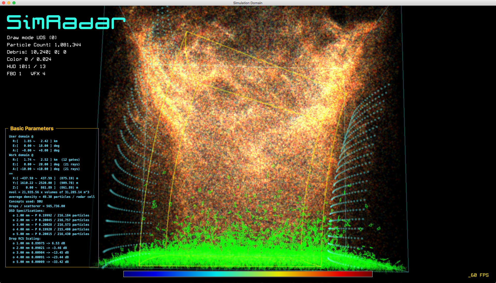

Simulation of a Radar
=====================

A polarimetric radar time-series emulator utilizing air-drag model for particle motions and a realistic radar cross library for particle back scattering calculations. Implemented with OpenCL for parallel computaing. If you would like to contribute to the framework, please email me at <boonleng@ou.edu>.



Getting the Project
-------------------

Follow these steps to get the project

1. For nVidia GPU users, make sure you have the latest [nVidia CUDA Driver].

2. Clone a git project[^1] from either ARRC's Git server or GitHub, using one of the following commands in Terminal:

    ```shell
    git clone https://git.arrc.ou.edu/cheo4524/simradar.git
    ```

    or

    ```shell
    git clone https://github.com/ouradar/simradar.git
    ```

3. Download [Sparkle Framework], extract and move the folder **Sparkle.framework**[^2] into the sub-folder **maOS/SimRadar**

4. Download the [LES, ADM & RCS data] in a zip archive (15GB), extract and move the folder **tables** into one of the following locations:
   - ~/Downloads
   - ~/Documents
   - ~/Desktop


5. Compile the code by running
    ```shell
    make
    ```
6. Run the `simradar` tool once to see if you receive a similar output.
   ```shell
   simradar
   ```
   should produce a screen output similar to the follows.
   ```
    08:55:47 : RS : Using default scan mode.
    08:55:47 : RS : Parsing scan pattern 'P:3.0,-12:12:0.01' ...
    08:55:47 : RS : Session initialized
    08:55:47 : RS : Drop concentration ~ 891 drops / m^3
    08:55:47 : RS : Found LES folder @ /Users/boonleng/Downloads/tables
    08:55:47 : RS : LES index @ /Users/boonleng/Downloads/tables/les/suctvort/fort.10_2
    08:55:47 : RS : LES enclosing_grid = 176 x 176 x 80
    08:55:47 : RS : LES grid spacing = 2.00 / 1.0212   2.00 / 1.0212   2.00 / 1.0500  (streched)
    08:55:47 : RS : LES file count = 16    nvol = 10    ncubes = 160
    08:55:48 : RS : Background ingest /Users/boonleng/Downloads/tables/les/suctvort/LES_mean_1_6_fnum1.dat 0 -> 0
    08:55:48 : RS : Background ingest /Users/boonleng/Downloads/tables/les/suctvort/LES_mean_1_6_fnum1.dat 1 -> 1
    08:55:48 : RS : Drops / scatterer = 279,838.53  (559,354,675,200.00 / 1,998,848)
    08:55:48 : Emulating 1,000 frames with 1,998,848 scatter bodies
    08:55:53 : Finished.  Total time elapsed = 5.29 s  (avg: 189.1 FPS / ins: 222.3 FPS)
    08:55:53 : Session ended
    ```

[^1]: An Xcode project is included so you can manage the source codes using Xcode on Mac OS X. Git is readily supported under Xcode.

[^2]: The latest release of Sparkle framework, which is developed and maintained by a third party (http://sparkle-project.org), can be downloaded from the official website but not necessary. The provided link works just as well.

Requirements
------------

On Linux:

* [GCC] GNU C Compiler
* [OpenCL] framework version 1.1 or 1.2

On Mac:

* [Xcode 6] or above
* [Sparkle Framework]

[GCC]: http://gcc.gnu.org
[OpenCL]: https://www.khronos.org/opencl
[HDF5]: https://www.hdfgroup.org/HDF5
[Xcode 6]: https://developer.apple.com/xcode
[Sparkle Framework]: http://arrc.ou.edu/~boonleng/files/Sparkle.framework.zip
[LES, ADM & RCS Data]: http://arrc.ou.edu/~boonleng/simradar/tables.zip
[Matlab Scripts]: http://arrc.ou.edu/~boonleng/simradar/simradar-matlab.zip
[nVidia CUDA Driver]: http://www.nvidia.com/object/mac-driver-archive.html


Radar Simulation Framework
==========================

Radar Simulation (RS) framework is a simply collection of C functions which abstract low-level interactions with the GPU for workload parallelization. OpenCL was selected because of the vendor neutral implementation.

Using the Radar Simulation (RS) Framework
-----------------------------------------

The simulation framework is developed is plain C for performance and portability. All calculations are implemented within the RS framework with functions prefix RS. To include the RS framework, there is only one header, i.e., `rs.h` is needed. The following example code creates a simple simulation domain and emulate a PPI scan:

```c
//
//  simple_ppi.c
//
//  This example illustrates a simple usage of the RS Framework to simulate a PPI scan.
//
//  Created by Boon Leng Cheong on 2/29/16.
//  Copyright © 2016 Boon Leng Cheong. All rights reserved.
//

#include "rs.h"

//
//
//  M A I N
//
//
int main(int argc, char *argv[]) {
    
    int k = 0;

    RSHandle  *S;
    
    // Initialize the RS framework
    S = RS_init();
    if (S == NULL) {
        fprintf(stderr, "%s : Some errors occurred during RS_init().\n", now());
        return EXIT_FAILURE;
    }
    
    // Set up the parameters: use the setter functions to change the state.
    RS_set_sampling_spacing(S, 15.0f, 1.0f, 1.0f);
    RS_set_antenna_params(S, 1.0f, 44.5f);
    RS_set_tx_params(S, 0.2e-6f, 50.0e3f);
    RS_set_prt(S, 1.0e-3f);

    // Set the DSD profile
    RS_set_dsd_to_mp(S);

    // Add the first debris object to be leaf
    RS_add_debris(S, OBJConfigLeaf, 1024);
    
    // Revise to the GPU preferred counts if there is no strict requirements on the debris count
    RS_revise_debris_counts_to_gpu_preference(S);
    
    // Propose a scan pattern
    POSPattern *scan_pattern = POS_init();
    RS_set_scan_pattern(S, scan_pattern);
    
    // After the wind table is set, we can use the API to suggest the optimal scan box
    RSBox box = RS_suggest_scan_domain(S);
    
    // Set the scan box
    RS_set_scan_box(S, box);

    // Show a summary of radar parameters
    RS_show_radar_params(S);

    // Populate the domain with scatter bodies.
    // This is also the function that triggers kernel compilation, GPU memory allocation and
    // upload all the parameters to the GPU.
    RS_populate(S);
    
    // Show some basic info
    const int num_pulses = 1200;
    printf("%s : Emulating %s frame%s with %s scatter bodies\n",
           now(), commaint(num_pulses), num_pulses>1?"s":"", commaint(S->num_scats));
    
    // At this point, we are ready to bake
    
    // ---------------------------------------------------------------------------------------------------------------
    
    float el = 3.0f;
    float az = -12.0f;
    
    // Now we bake
    for (k = 0; k < num_pulses; k++) {
        RS_set_beam_pos(S, az, el);
        RS_make_pulse(S);
        RS_advance_time(S);
        
        // This makes az go from -12 to +12.
        az = az + 0.02f;
        
        // Show some output to the screen so we know everything is okay.
        if (k % 300 == 0) {
            fprintf(stderr, "Pulse %d\n", k);
        }
    }
    
    // Retrieve the results from the GPUs
    RS_download(S);
    
    printf("%s : Final scatter body positions, velocities and orientations:\n", now());
    
    RS_show_scat_pos(S);
    
    RS_show_scat_sig(S);
    
    RS_free(S);
    
    return EXIT_SUCCESS;
}
```

Assuming that you already have the library compiled successfully and the archived library is placed under `lib/librs.a`, this example can be compiled on a Mac using the following command:

    gcc -I./ -L./lib -o simple_ppi simple_ppi.c -lrs -framework OpenCL -lm -lpthread

Alternatively, if you are on a linux machine, the following should work:

    gcc -I./ -L./lib -o simple_ppi simple_ppi.c -lrs -lOpenCL -lm -lpthread

On linux machines, it is important that the GPU driver's include and library paths are also included in the compilation command.


The SimRadar App for Mac OS X
-----------------------------

A dedicated project SimRadar, which is a Mac OS X implemtation of visualization and graphical user interface, is included. It demonstrates how to wrap the framework in Objective-C. There is currently no plan to make this a full-fledge application that allows users to access all simulation parameters through the GUI.


Implementation
==============

The emulator is implemented with a master handler in a C structure, which collects all the simulator parameters, some of which are user-set radar parameters, environmental velocity, air-drag-model and radar-cross-section tables. The framework is implemented such that minimal interaction is needed to access directly to the big structure that contains these intricate parameters.

The radar parameters may be set in arbitrary order prior to the key function to bring the simulator online, `RS_populate()`. The function `RS_populate()` allocates resources needed by the scatterer and farms out the workload to OpenCL devices. After this stage, only the online functions are allowed. These include time advancing, radar beam steering and radar pulse composition.

Basic Attributes and Functions
------------------------------

Multiple arrays of type `cl_float` are used to keep track of a set of attributes associated with each scatterer. The following list provides a summary of the attriutes and the variables used on the C-level abstraction.

    cl_mem                 scat_pos;   // x, y, z coordinates; and w = drop radius in m
    cl_mem                 scat_vel;   // u, v, w wind components
    cl_mem                 scat_ori;   // orientation descbried by a quaternion
    cl_mem                 scat_tum;   // tumbling motion = change of orientation derived from ADM
    cl_mem                 scat_aux;   // auxiliary attributes: s0 = range; s1 = tbd; s2 = DSD bin index; s3 = angular weight
    cl_mem                 scat_rcs;   // radar cross section: Ih Qh Iv Qv
    cl_mem                 scat_sig;   // signal: Ih Qh Iv Qv
    cl_mem                 scat_rnd;   // random seed

### Setup Functions to Parameterize the Simulator ###

    RS_set_prt()
    RS_set_lambda()
    RS_set_density()
    RS_set_antenna_params()
    RS_set_tx_params()
    RS_set_scan_box()
    RS_add_debris()
    
### Convenient Functions for Simulation Setup ###

    RS_suggest_scan_domain()
    RS_revise_debris_counts_to_gpu_preference()

### Start Function to Bring the Simulator Online ###

    RS_populate()

### Online Functions for Simulation Time Evolution ###

    RS_set_beam_pos()
    RS_advance_time()
    RS_make_pulse()


For the Programming Masters
---

These functions are of low levels. Normal usage should not need to tinker with these.

### Functions to Interact Directly with GPUs ###

These functions take input format that are readily suitable for GPU array buffers. These functions are appropriate when the data layout is identical to array buffer data on GPUs. It is important that the corresponding table parameters are first cached at the master handler, i.e., `vel_desc`, `adm_desc` and `rcs_desc`. These are not the same as the CL worker correspondence.

    RS_set_vel_data()
    RS_set_adm_data()
    RS_set_rcs_data()

### Functions to Interact with Master Handler ###

These functions take input format that are in native format from the data supplier. They create a copy of the data but layout the data in structure that can be used by the functions that interact directly with the GPUs.

    RS_set_vel_data_to_LES_table()
    RS_set_adm_data_to_ADM_table()
    RS_set_rcs_data_to_RCS_table()

Publications
============

B. L. Cheong, D. J. Bodine, C. J. Fulton, S. M. Torres, T. Maruyama, R. D. Palmer, SimRadar: A Polarimetric Radar Time-Series Simulator for Tornadic Debris Studies, *IEEE Trans. Geos. Remote Sensi.*, **55**(5), pp 2858-2870, 2017.


Notes
=====
